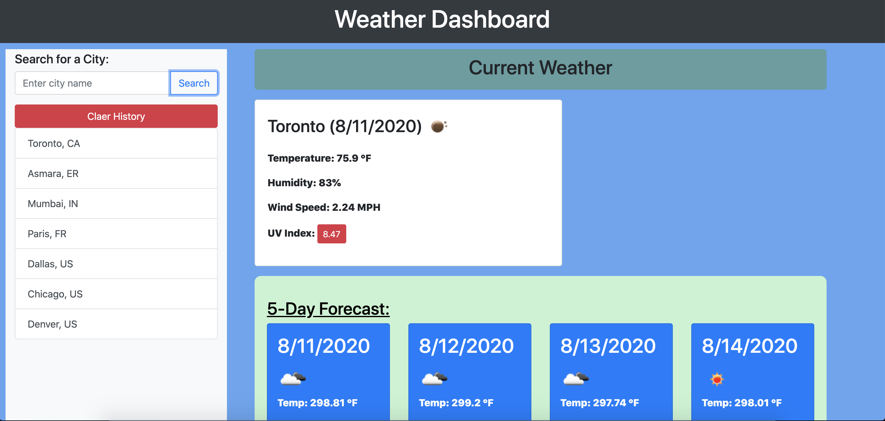
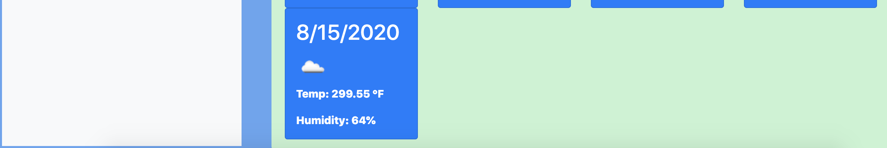
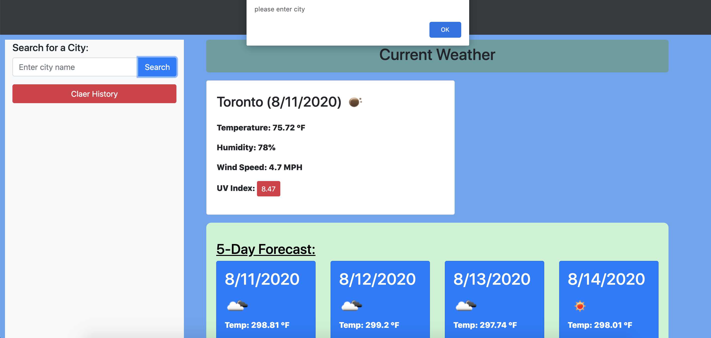
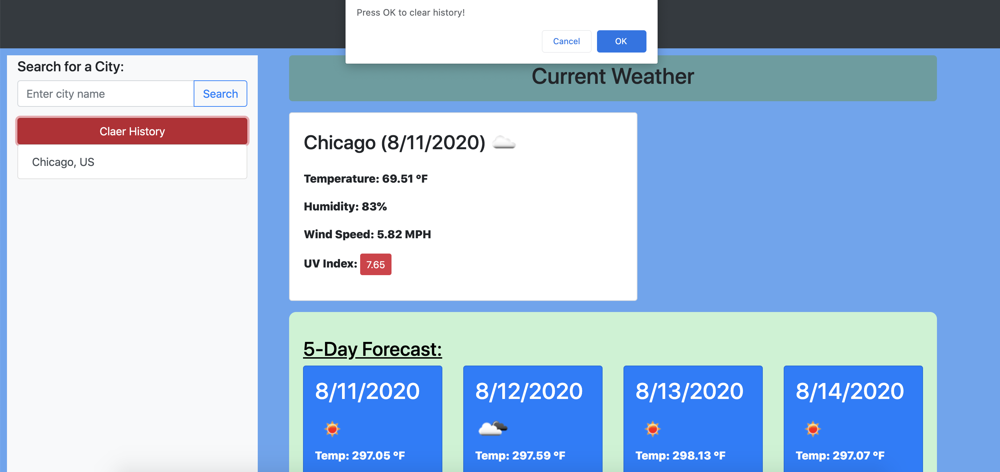

# Weather-Forcast

This Weather Dashboord application is developed based on [OpenWeather API](https://openweathermap.org/api) to show my personal skill on the ablity to fetch data from third-party APIs and retrive neccessary parameters for the weather forcast of a particular city. A `waz-app.html` file and directories `Assets/css/waz-app.css`, `Assets/js/waz-app` and `Assets/images` are linked to this app.

# Instructions

1. Input name of the city in the search city box, then click search to get the current weather and five days weather forcast. 

2. If blank city is entered or there is spelling error, an errer alert box is desplayed and no result is desplayed for the search.

3. Else if a city is entered correctly, the current weather and weather forcast is desplayed and the city is added to the searched history local storage data. 

4. Furthermore, the weeather of a particular city can be searched from the search box or from the city list.

5. Cities history local storage can be cleared by clicking in the clear histry button after a confirmition for an alert to avoid accidental clear.

# The Link to the Functional App
Weather Forcast: https://bbeyenene.github.io/Weather-Forcast/waz-app.html
